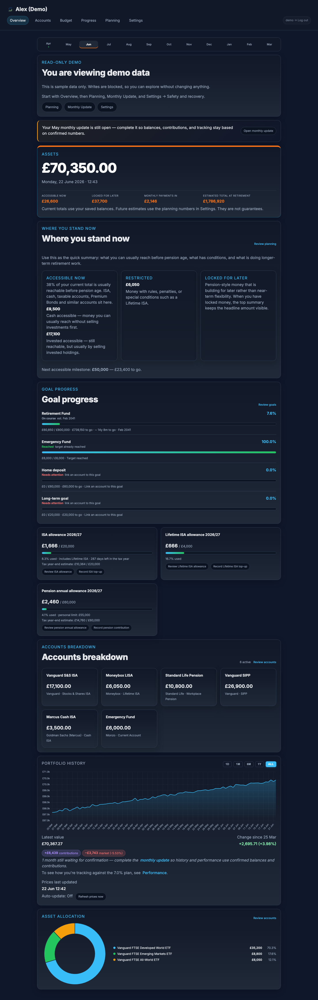
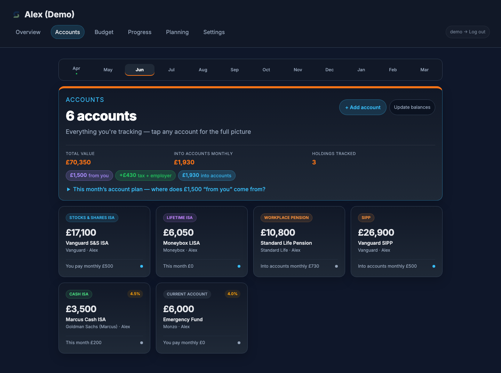
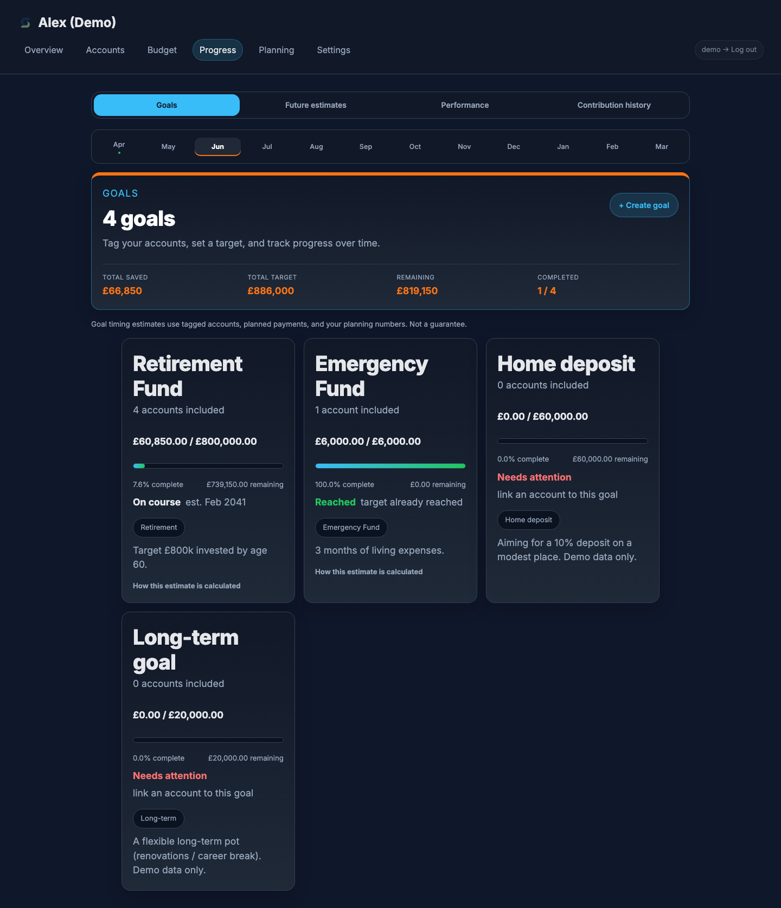
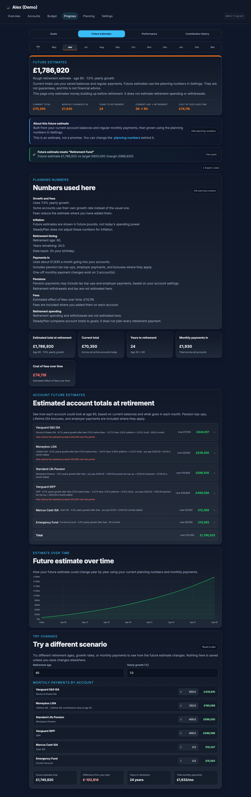
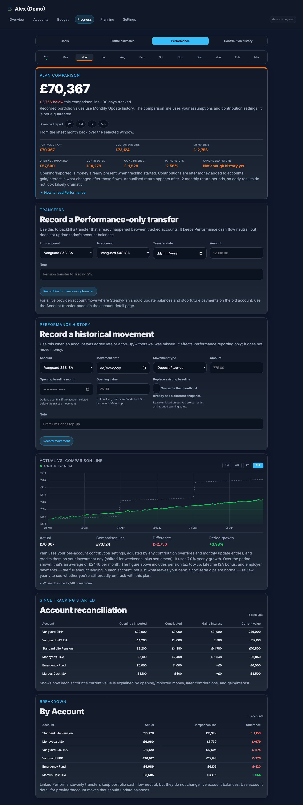
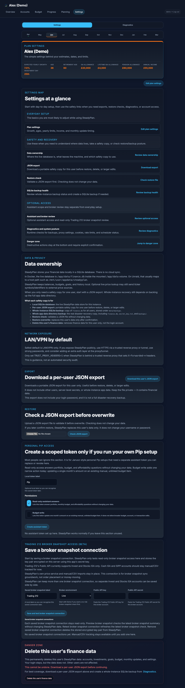

# SteadyPlan (formerly Shelly Finance)

A self-hosted personal finance planning and visibility tool for UK investors 🐢. See where you stand today, what is cash-accessible now, what invested money is still reachable, what is restricted, and how monthly decisions connect to long-term scenario estimates — on your own server/home network.

Primary domain: **steadyplan.co.uk** (with **steady-plan.co.uk** as an optional redirect/secondary domain).

Primary GitHub repo: `https://github.com/Jahumac/steadyplan`

Primary Docker image: `ghcr.io/jahumac/steadyplan:latest`

Legacy image (during transition): `ghcr.io/jahumac/shelly-finance:latest`

   

## Website

- Static website source lives in `site/`
- Public site is deployed from `site/` on Cloudflare Pages (build: none, output directory: `site`)
- Canonical product domain: **steadyplan.co.uk**
- Main public pages: Home, Tour, Roadmap, Docs, and About
- Public site supports a manual light/dark toggle without a build step

---

## Why SteadyPlan?

Most finance apps want your login credentials or send your data to the cloud. SteadyPlan runs entirely on your machine (or home server) with a local SQLite database. Core use does not require any bank login sharing, broker linking, or third-party account. You only need an external API key if you choose to enable optional automated price lookups.

It's designed specifically for **UK investors** — ISAs, SIPPs, Lifetime ISAs, workplace pensions, and taxable accounts (GIAs) — with GBP currency, UK tax year tracking, CSV import from major UK brokers, and an optional Trading 212 broker snapshot review beta for preview-first broker account review.

---

## Privacy Model (What Leaves Your Machine)

- **Stays local:** Your financial database lives in `data/finance.db` (SQLite). SteadyPlan does not sync your data to any cloud service.
- **No bank/broker linking:** SteadyPlan does not connect to your bank or broker via OAuth, screen scraping, or open banking flows.
- **May leave the machine (optional):** If you enable live prices, SteadyPlan sends **ticker symbols / identifiers** to external price sources (Yahoo Finance; optionally Twelve Data) to fetch prices. Your account balances and transaction history are not sent.
- **Twelve Data API key is optional:** If `TWELVE_DATA_API_KEY` is not set, SteadyPlan can still be used (manual balances, manual holdings values, and any Yahoo-backed lookups).
- **If you want “air-gapped”:** You can run SteadyPlan without any external price lookups by relying on manual balances / manual holdings values and avoiding ticker-based refreshes.
- **Internet exposure:** SteadyPlan is designed for home-network use. You can access it over LAN/VPN, or (optionally) expose it publicly through standard self-hosting patterns (reverse proxy + HTTPS, Cloudflare Tunnel, etc.). Because SteadyPlan contains sensitive financial data, treat public exposure as an advanced admin choice and configure it carefully (extra auth, strong passwords).

### Network posture (recommended)
- Safe default: run SteadyPlan on your home LAN or VPN only. Do not port-forward it to the public internet.
- Optional public access: use HTTPS on a reverse proxy (e.g. Nginx Proxy Manager) or a tunnel/VPN approach (e.g. Cloudflare Tunnel, Tailscale). Enable production cookie settings and add an extra auth layer.
- If you publish behind HTTPS, set `APP_ENV=production`. If you also want SteadyPlan to honour client IP/protocol headers from that proxy, set `TRUST_PROXY_HEADERS=1` and widen Gunicorn's forwarded-header allowlist deliberately via `FORWARDED_ALLOW_IPS`.

---

## Features

### Accounts & Holdings
Track any combination of investment accounts: Stocks & Shares ISA, Cash ISA, Lifetime ISA, SIPP, Workplace Pension, taxable account (GIA), and more. Each account can be valued manually (enter a balance) or built up from individual holdings with live price lookups via Twelve Data and Yahoo Finance (with automatic FX conversion for USD/EUR holdings).

### JSON Export & Restore
Download a user-scoped JSON export from **Settings**, and restore from that file via a two-step flow: validate/dry-run preview first, then explicit confirmation to replace your data for the current user only.

### Broker CSV Import
Import holdings directly from your broker's CSV export. Supported platforms:

- **Trading 212** — transaction history (buys/sells reconciled to net positions)
- **InvestEngine** — valuation statements or transaction history
- **Vanguard Investor** — portfolio snapshot
- **Hargreaves Lansdown** — portfolio snapshot (handles pence-to-pounds conversion)
- **AJ Bell** — portfolio snapshot
- **Freetrade** — activity export (buys/sells/dividend reinvestments)
- **Interactive Investor** — portfolio snapshot
- **Generic CSV** — flexible column matching for any other format

Don't use any of these? Download the [CSV template](app/static/steadyplan-holdings-template.csv) and fill in your holdings manually. (The legacy `shelly-holdings-template.csv` filename is kept as a compatibility alias.)

### Broker snapshot review beta
Settings includes an optional **Trading 212 broker snapshot review (beta)** flow with saved broker snapshot connections. You can save and test encrypted API credentials on your own server, preview a broker snapshot against your tracked holdings, and keep manual/CSV tracking as the fallback until you choose to apply reviewed changes. These saved broker snapshot connections stay read-only and currently focus on Invest and Stocks ISA accounts.

### Monthly Update
A lightweight monthly check-in to keep your numbers fresh: update account balances, review expected contributions (confirm/skip), add an optional note, and mark the month complete.

Draft monthly updates support editing, but **only completed monthly updates are treated as financial truth** for allowance and performance calculations.

Completing a monthly update saves snapshots so you can track how your portfolio changes over time. Holdings-based accounts snapshot from holdings value; manual/Premium Bonds accounts snapshot only if their balance was updated in that update (to avoid silently recording stale values as truth).

### Data Health
If something needs attention (e.g. no accounts, stale snapshots, missing assumptions), SteadyPlan surfaces a compact warning on **Overview**. Healthy status is kept out of the dashboard so Overview stays focused on your financial summary.

### Budget
Monthly income, expenses and savings overview with auto-save. Navigate between months with arrows. Budget items can be linked directly to account contributions so your savings plan stays in sync.

### Goals
Set savings targets and track progress. Goals can be linked to tagged accounts — e.g. tag your ISA accounts as "Retirement" and create a goal that tracks the combined balance.

### Retirement scenario estimates
Year-by-year and month-by-month scenario estimates using saved balances, contribution settings, and growth assumptions. These scenario estimates are not guarantees. Respects Lifetime ISA contribution rules (stops at age 50). Export scenario estimates to Excel (.xlsx) with per-account breakdowns.

### Granular Fee Tracking
Accounts support detailed fee modelling: platform fee (% with optional £ cap), flat annual platform fee (£), and fund fee / OCF (%). SteadyPlan combines these into an effective annual fee, subtracts it from your growth rate, and shows the lifetime cost of fees in both the app and Excel exports. All fee fields are optional — tucked behind an "Advanced: Fees" toggle so they don't clutter the setup for casual users. Scenario estimates show "with fees" vs "without fees" so you can see exactly what your broker and funds cost you over time.

### Performance Tracking
Track your actual portfolio returns over time using the modified Dietz method. Compare actual performance against an assumptions-based "on-plan" growth line. Contribution cash flow uses the effective “into pot” amount (tax relief, LISA bonus, employer contributions, minus any contribution fee) and only treats completed monthly updates as confirmed truth.

### Tax Year Tracking
ISA and Lifetime ISA allowance progress bars, tax year countdown, and automatic tax year labelling (April 6 boundary).

### Multi-User Support
Multiple users can share a single SteadyPlan instance, each with their own accounts, budgets and data. Admin user manages access.

### Assistant access
Settings includes optional scoped **Assistant access** for a personal Pip setup. Unlike a general API token, an assistant token only works on assistant endpoints, can be regenerated or revoked in the UI, and can be limited to read-only answers or one narrow budget-write permission.

### Contribution Overrides
Temporarily change a monthly contribution (e.g. parental leave, career break) without losing your long-term plan.

### Diagnostics & backup health
Settings → Diagnostics shows whole-instance backup status, lets admins create SQLite backups, and keeps backup/restore guidance close to the product so trust boundaries stay explicit.

### PWA & Mobile
- Install SteadyPlan as a phone app — visit the URL in your mobile browser and tap "Add to Home Screen". Works full-screen with its own icon.
- Installable app shell (PWA) with a service worker for static assets (CSS/JS/icons).
- **Privacy-first offline behaviour:** authenticated financial pages are not cached for offline viewing. If you're offline you'll see an offline page and can retry once reconnected.

### Install on Mobile
- iOS (Safari): open the URL → Share → Add to Home Screen
- Android (Chrome): open the URL → menu → Install app / Add to Home screen

### Try Safely With Demo Data
- Safest order: screenshots/tour first, then your own local install on LAN or VPN for hands-on evaluation.
- SteadyPlan includes a demo seed script that populates realistic UK investor data (accounts, holdings, goals, budget, history).
- You can explore the full UI without entering real financial data.

Seed demo data (local Python):

```bash
.venv/bin/python scripts/seed_demo.py --username demo
```

Seed demo data (Docker):

```bash
docker exec -it steadyplan python scripts/seed_demo.py --username demo
```

Enable a public read-only demo login:

- Create a `demo` user (any password) and set `DEMO_PUBLIC_LOGIN_ENABLED=1`.
- Then the host can offer `/demo` (or the “Open read-only demo” button on the login page) for sample-data evaluation. The demo user is read-only: mutating requests are blocked.
- Treat that public demo as an explicit host choice, not the default trust path for real use.

---

## Backup Strategy (Recommended)

SteadyPlan supports two complementary backup styles:

1. **JSON export (per user)** — download from **Settings → Download JSON export**. Best for portability (moving data between instances) and user-scoped restores.
2. **Volume/SQLite backup (whole instance)** — back up the `data/` volume/directory that contains:
   - `finance.db` (your SQLite database)
   - `secret_key.txt` (Flask secret key; needed to keep sessions stable across restores)
   - `backups/` (if you use the built-in SQLite backup tool from Diagnostics)

The built-in “SQLite backup” tool creates copies of `finance.db` under `data/backups/`. It does not back up `secret_key.txt`, so your normal volume/appdata backup should include the whole `data/` directory.

Suggested simple routine for self-hosters:

- Back up the `data/` volume on a schedule (NAS snapshot, rsync, borg, etc.).
- Periodically download a JSON export for an additional “belt and braces” copy.
- Before relying on backups, do a restore drill: validate a JSON export in Settings, and (separately) restore a copy of `data/` into a test container.

---

## Quick Start (Local)

**Requirements:** Python 3.10+

```bash
# 1. Clone the repo
git clone https://github.com/jahumac/steadyplan.git
cd steadyplan

# 2. Create a virtual environment
python -m venv .venv
source .venv/bin/activate       # Windows: .venv\Scripts\activate

# 3. Install dependencies
pip install -r requirements.txt

# 4. Run
python run.py
```

Open [http://localhost:8000](http://localhost:8000) in your browser. On first run you'll be asked to create an admin account. The SQLite database is created automatically in `data/finance.db`.

To run in debug mode with auto-reload:

```bash
FLASK_DEBUG=1 python run.py
```

---

## Docker (Recommended for Self-Hosting)

```bash
docker compose up -d
```

This uses the published image: `ghcr.io/jahumac/steadyplan:latest`.

- The app runs on port **8000** by default.
- Your database persists in the `data/` directory which is mounted as a volume.
- Release builds also publish version tags (e.g. `:1.2.3`); `:latest` tracks `main`.

Migration note: if you previously used the legacy image or a data folder named `shelly-finance`, you can keep the same host path mounted to `/app/data` so your database is reused.

First boot:

- On first visit you'll be redirected to `/setup` to create an admin account.
- The database file is created/used inside the mounted `data/` volume (`data/finance.db`).
- `TWELVE_DATA_API_KEY` is optional — you can run SteadyPlan without it.

### What lives in `data/` (persistent)
- `finance.db` — SQLite database (your data)
- `secret_key.txt` — app secret (keep this with the DB so sessions stay stable across restores)
- `backups/` — optional built-in SQLite backups created from **Settings → Diagnostics**

To change the port, edit `docker-compose.yml`:

```yaml
ports:
  - "9000:8000"   # host:container — change the left number
```

### Developer option (build from source)

```bash
docker compose --profile dev up -d steadyplan-dev
```

The dev profile builds the image locally from the Dockerfile and runs it on port **8001** by default.

### Unraid / Home Server

See [DEPLOY.md](DEPLOY.md) for step-by-step instructions on deploying to Unraid via Docker, including SSH setup, volume mounting, and update workflow.

---

## CSV Import Guide

### From Your Broker

1. Go to **Monthly Update** in SteadyPlan
2. Select your broker from the dropdown
3. Upload the CSV file your broker provides (usually found under "Statements", "Export", or "Download" in your broker's app/website)
4. SteadyPlan will match the CSV rows to your existing holdings, showing you a preview
5. Review, adjust if needed, and confirm the import

### Using the Template

If your broker isn't listed, or you prefer to enter holdings manually in bulk:

1. Download [`steadyplan-holdings-template.csv`](app/static/steadyplan-holdings-template.csv)
2. Fill in your holdings — one row per holding with: `name`, `ticker`, `units`, `price`, `value`
3. Import using the **Generic CSV** option in Monthly Update

The template looks like this:

```csv
name,ticker,units,price,value
Vanguard FTSE Global All Cap Index Fund,GB00BD3RZ582,150.2345,187.63,28186.72
Vanguard LifeStrategy 80% Equity Fund,GB00B4PQW151,85.1200,243.10,20693.47
iShares Core MSCI World ETF,SWDA,42.0000,82.15,3450.30
```

**Note:** The CSV import updates existing holdings that are already set up in SteadyPlan (matched by ticker or name). To get started, add your accounts and holdings through the app first, then use CSV import for quick monthly updates going forward.

---

## Project Structure

```
app/
├── __init__.py            # App factory, blueprint registration, login manager, demo/read-only guard
├── config.py              # Environment config, database path, secret key management
├── calculations.py        # Scenario estimates, returns, goal tracking, tax year logic
├── demo.py                # Demo-user helpers and read-only enforcement
├── extensions.py          # CSRF, limiter, cache-busting helpers, scheduler wiring
├── routes/
│   ├── auth.py            # Login, setup, user management
│   ├── overview.py        # Dashboard with metrics and net worth chart
│   ├── accounts.py        # Account + holdings CRUD, allocation charts
│   ├── holdings.py        # Holdings catalogue, prices, refresh actions
│   ├── budget.py          # Budget CRUD, auto-save, annual import, debts, trends
│   ├── goals.py           # Goal tracking with tag-based account linking
│   ├── projections.py     # Scenario estimates views and account series endpoints
│   ├── performance.py     # Modified Dietz returns tracking
│   ├── monthly_review.py  # Monthly Update workflow, notes, checklist, CSV import
│   ├── allowance.py       # ISA, pension, dividend, and CGT allowance tracking
│   ├── planning.py        # Cash-accessible, invested-accessible, restricted, and locked-for-later money view and insights
│   ├── api.py             # General API + scoped assistant endpoints
│   ├── export.py          # Excel export (scenario estimates, budget, performance)
│   └── settings.py        # Assumptions, assistant access, backups, diagnostics, reset
├── models/
│   ├── accounts.py        # Accounts, holdings, imports, balances
│   ├── budget.py          # Budget items, debts, linked entries
│   ├── goals.py           # Goal storage and account-tag linking
│   ├── users.py           # Users, API tokens, assistant audit log
│   ├── planning*.py       # Assumptions, allowances, snapshots, review helpers
│   └── schema.py          # SQLite schema + migrations
├── services/
│   ├── assistant_access.py        # Assistant token labels, permissions, activity helpers
│   ├── assistant_api.py           # Assistant budget/portfolio/affordability payload builders
│   ├── backups.py                 # Backup health and SQLite backup helpers
│   ├── csv_parsers.py             # Broker-specific CSV parsers
│   ├── data_health.py             # Overview attention summary
│   ├── monthly_review_checklist.py# Monthly Update notes/checklist helpers
│   ├── prices.py                  # Twelve Data / Yahoo price services
│   └── restore_*.py               # JSON restore staging, validation, commit helpers
├── templates/             # Jinja2 HTML templates (private app shell)
└── static/
    ├── css/styles.css     # Main app stylesheet
    ├── js/charts.js       # Chart rendering
    ├── js/app.js          # App shell behaviour
    ├── manifest.json      # PWA manifest
    ├── sw.js              # Service worker
    ├── brand/             # Logo mark + app icon assets
    └── icons/             # App icons (180px, 192px, 512px)
site/                      # Public website + lightweight docs hub
scripts/                   # Seed demo data, screenshots, backups, token CLI
data/
├── finance.db             # SQLite database (auto-created, git-ignored)
└── secret_key.txt         # Flask secret key (auto-generated, git-ignored)
```

---

## Screenshots

**Overview** — net worth, goals, allowances and portfolio chart at a glance



**Accounts** — all your accounts in one place, with live holdings tracking



**Goals** — savings targets linked to tagged accounts



**Scenario estimates** — retirement scenario estimates with fee impact and scenario planner



**Performance** — actual returns tracked with modified Dietz, vs your plan



**Settings** — growth rate, ages, allowances and assumptions



---

## Roadmap

### Available now
- Self-hosted private finance planning with local SQLite storage
- Answer-first Overview, Monthly Update, Planning, and core compact-screen cleanups
- Data Health, JSON export/restore, Diagnostics, and trust-posture checks close to the product
- Assistant access with scoped read-only answers and one narrow budget-write permission
- Public website with Tour, Roadmap, docs hub, and optional read-only demo path
- Optional Trading 212 broker snapshot review beta with saved broker snapshot connections and a preview-before-apply review flow

### Improving next
- Reduce density in the heaviest setup and settings surfaces
- Keep tightening everyday data-entry, import, and validation flows
- Sharpen roadmap/docs/site parity so public copy matches the current product truth
- Strengthen supportability and auth boundaries before any tiny hosted beta discussion

### Exploring later
- Hosted SteadyPlan only if safety, supportability, and trust are strong enough
- Invite-only private testing before any broader hosted offering
- API evolution that stays narrow and safe for external clients

---

## How It Works

### Data Storage
Everything lives in a single SQLite file (`data/finance.db`). No external database to configure. The `data/` directory is git-ignored — your financial data never ends up in version control.

### Live Prices
Holdings with a ticker symbol get live price lookups via Yahoo Finance. SteadyPlan tries the ticker as-is first, then appends `.L` for London Stock Exchange listings. Prices are cached in a local catalogue and updated when you refresh.

### Monthly Snapshots
Each time you complete a monthly update (or update an account balance), SteadyPlan saves a snapshot. These snapshots power the net worth history chart on the overview page and the performance tracking calculations.

### Security
SteadyPlan uses Flask-Login for authentication with hashed passwords. It's designed for home network use — if you want to expose it to the internet, put it behind a reverse proxy with additional auth (e.g. Authelia, Cloudflare Tunnel, or basic auth).

---

## Supported Account Types

| Type | Description |
|------|-------------|
| Stocks & Shares ISA | Tax-free investment wrapper |
| Cash ISA | Tax-free cash savings |
| Lifetime ISA | Government-bonused savings (25% top-up, age restrictions) |
| SIPP | Self-invested personal pension |
| Workplace Pension | Employer pension scheme |
| General Investment Account | Standard taxable investment account |
| Other | Anything else you want to track |

---

## Known Limitations

- **GBP only** — no multi-currency support yet
- **UK-focused** — account types and tax year logic are UK-specific
- **Yahoo Finance** — live prices depend on Yahoo Finance availability; some funds may not have tickers
- **Single device** — no cloud sync between devices (by design)

---

## Contributing

SteadyPlan is a personal project shared for others to use and learn from. If you find a bug or have a feature idea, feel free to open an issue. Pull requests are welcome.

### Visual screenshots (Playwright)

For quickly eyeballing UI changes across desktop + mobile widths, there's a Playwright-based screenshot script. One-time setup:

```bash
.venv/bin/pip install playwright
.venv/bin/playwright install chromium
```

Then, with the app running on `localhost:8000`:

```bash
.venv/bin/python scripts/screenshot.py --user alice --password <pw>
```

PNGs land in `tests/screenshots/<timestamp>/`, one per page × viewport. Run before and after a UI change and diff the folders.

---

## License

MIT — use it, fork it, break it, fix it.
